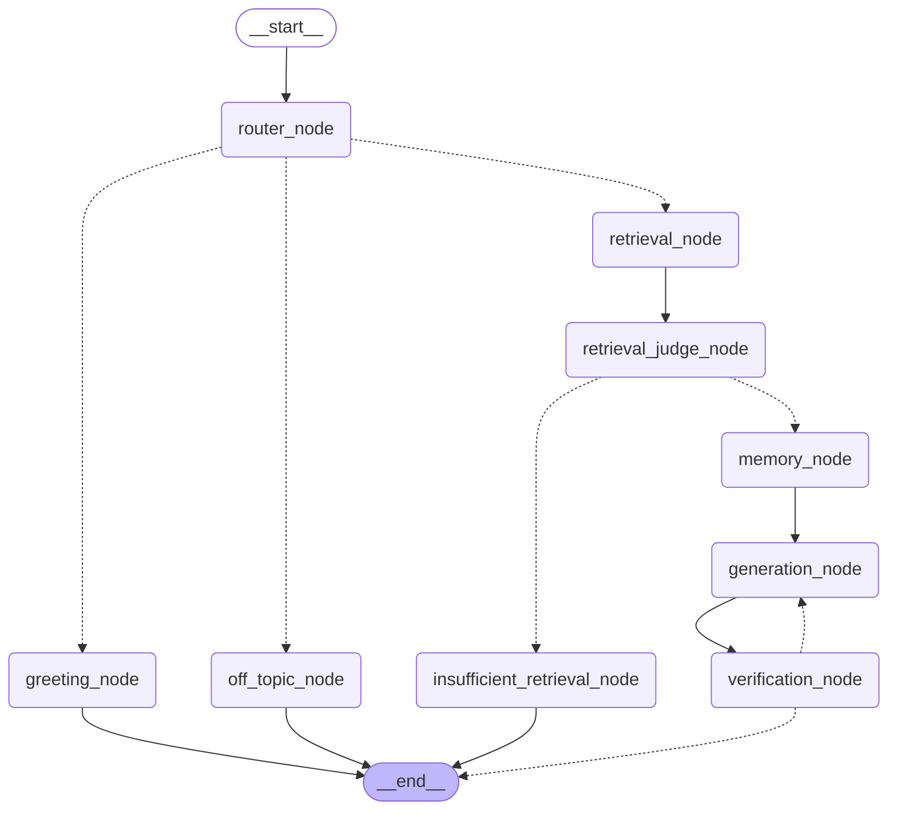

```mermaid
graph TD;
	__start__([<p>__start__</p>]):::first
	router_node(router_node)
	greeting_node(greeting_node)
	off_topic_node(off_topic_node)
	retrieval_node(retrieval_node)
	retrieval_judge_node(retrieval_judge_node)
	insufficient_retrieval_node(insufficient_retrieval_node)
	memory_node(memory_node)
	generation_node(generation_node)
	verification_node(verification_node)
	__end__([<p>__end__</p>]):::last
	__start__ --> router_node;
	generation_node --> verification_node;
	memory_node --> generation_node;
	retrieval_judge_node -.-> insufficient_retrieval_node;
	retrieval_judge_node -.-> memory_node;
	retrieval_node --> retrieval_judge_node;
	router_node -.-> greeting_node;
	router_node -.-> off_topic_node;
	router_node -.-> retrieval_node;
	verification_node -.-> __end__;
	verification_node -.-> generation_node;
	greeting_node --> __end__;
	insufficient_retrieval_node --> __end__;
	off_topic_node --> __end__;
	classDef default fill:#f2f0ff,line-height:1.2
	classDef first fill-opacity:0
	classDef last fill:#bfb6fc
```