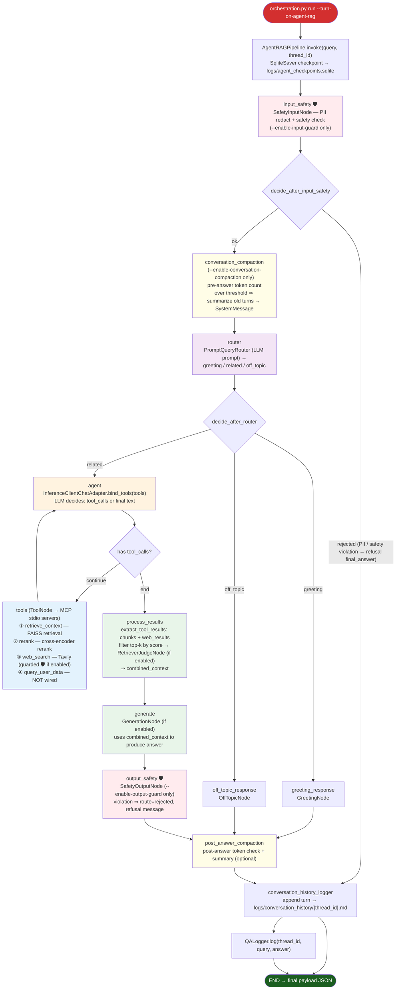

# Agentic RAG Flow

Mermaid diagram of the actual implemented pipeline through `orchestration.py` → `AgentRAGPipeline` (`agent_graph.py`).

> **⚠ Code vs diagram note:** The rejection routing check lives at the `conversation_compaction` exit (`_route_after_compaction`), not at `input_safety`, because the graph always flows `input_safety → conversation_compaction` unconditionally. On the rejected path compaction is a no-op (no messages to summarize). The diagram shows the decision at `input_safety` to reflect *semantic ownership* — the rejection originates from the input guard, not from compaction.

## Key implementation details

| Node | Source | Behavior |
|------|--------|----------|
| `input_safety` | `SafetyInputNode` | PII redaction + NSFW/Toxicity check. Skipped if `--enable-input-guard` not set. On rejection, sets `route=rejected` + refusal `final_answer`. |
| `conversation_compaction` | `ConversationCompactionNode.pre_answer_check()` | Token count via `AutoTokenizer`. If total > threshold × max_input_tokens, summarizes older turns into a `SystemMessage`. |
| `router` | `PromptQueryRouter` | LLM call with `prompts/route_node_prompt.txt`. Maps `retrieval` → `related`, `greeting` → `greeting`, `off_topic` → `off_topic`. |
| `agent` | `InferenceClientChatAdapter.bind_tools(tools)` | LLM with OpenAI-compatible tool schema. Returns `tool_calls` or text content. |
| `tools` | `ToolNode` (LangGraph) | Spawns MCP stdio servers via `MultiServerMCPClient`. Only `web_search` is wrapped by `GuardTool` when guards enabled. |
| `process_results` | `extract_tool_results()` + optional `RetrieverJudgeNode` | Chunks sorted by score, top-k filtered, judged if enabled. Combined with web results. |
| `generate` | `GenerationNode` | Sends `combined_context` to LLM for final answer. Falls back to last AI message if disabled or no context. |
| `output_safety` | `SafetyOutputNode` | Checks generated answer. If violation detected, replaces with refusal and sets `route=rejected`. |
| `post_answer_compaction` | `ConversationCompactionNode.post_answer_check()` | Second compaction pass after generation. Writes token debug log if `--enable-token-debug-log`. |
| `conversation_history_logger` | `append_turn_to_file()` | Appends user/assistant/system messages to `logs/conversation_history/{thread_id}.md` on every turn. |

## MCP tools

| Tool | Server | Guards |
|------|--------|--------|
| `retrieve_context` | `mcp_servers/retrieve_context_server.py` | None (raw) |
| `rerank` | `mcp_servers/rerank_server.py` | None (raw) |
| `web_search` | `mcp_servers/web_search_server.py` | `GuardTool` wrapping `SafetyInputNode` + `SafetyOutputNode` (when `--enable-input-guard` or `--enable-output-guard`) |
| `query_user_data` | `mcp_servers/query_user_data_server.py` | Not wired into the agent |
