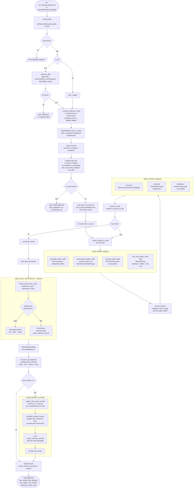

```mermaid
flowchart TB
    Start(["CLI: run_indexing_pipeline.sh<br/>or IndexingPipeline.run(path)"]) --> Resolve

    Resolve["resolve path<br/>= settings.indexing.input_path if None"]
    Resolve --> Exists{"path exists?"}
    Exists -- no --> Err1[/"raise FileNotFoundError"/]
    Exists -- yes --> Kind{"is dir?"}

    Kind -- yes --> Discover["_discover_files<br/>rglob, filter SUPPORTED_EXTENSIONS,<br/>skip hidden, sorted"]
    Kind -- no --> SingleFile["files = [path]"]
    Discover --> EmptyDir{"any files?"}
    EmptyDir -- no --> Err2[/"raise ValueError<br/>no supported files"/]
    EmptyDir -- yes --> ResolveCol
    SingleFile --> ResolveCol

    ResolveCol["_resolve_collection_name<br/>= dir basename or parent.name<br/>normalize a-z0-9_-, fallback default"]

    ResolveCol --> LoadMani["IndexManifest.load_or_empty<br/>.index_manifests/&lt;collection&gt;/<br/>manifest.json"]
    LoadMani --> BuildChunker["_build_chunker<br/>recursive / semantic / markdown"]
    BuildChunker --> Partition

    Partition["partition files into<br/>to_load vs skipped<br/>by manifest.is_unchanged<br/>fast: size+mtime, fallback: SHA-256"]

    Partition --> AnyToLoad{"to_load empty?"}
    AnyToLoad -- yes --> EarlyExit(["return IndexingResult<br/>files_skipped=N, no LLM/embed call"])

    AnyToLoad -- no --> LazyStore["build store if not built yet<br/>lazy to skip embedding cost<br/>when fully cached"]

    LazyStore --> PerFileLoop["for each file in to_load"]

    PerFileLoop --> SelectLoader["_select_loader_for_path<br/>by extension"]

    SelectLoader --> LoaderStrat
    subgraph LoaderStrat["step1_loaders (registry)"]
        direction TB
        L1["pymupdf_loader (.pdf)<br/>fitz text/images +<br/>pdfplumber tables"]
        L2["unstructured_loader (.pdf)<br/>partition_pdf hi_res<br/>NarrativeText/Table/Image"]
        L3["docling_loader (.pdf)<br/>DocumentConverter,<br/>strong tables"]
        L4["bs4_html_loader (.html .htm)<br/>BeautifulSoup<br/>headings + tables + img refs"]
    end

    LoaderStrat --> RawDocs["raw Documents<br/>metadata: source, page,<br/>element_type, loader"]

    RawDocs --> ChunkerStrat
    subgraph ChunkerStrat["step2_chunkers (registry)"]
        direction TB
        C1["recursive<br/>RecursiveCharacterTextSplitter"]
        C2["semantic<br/>embedding-based<br/>breakpoints"]
        C3["markdown<br/>header-aware split<br/>+ size splitter"]
    end

    ChunkerStrat --> ChunksByFile["chunks_for_file<br/>tracked in chunks_by_file"]
    ChunksByFile --> MoreFiles{"more files?"}
    MoreFiles -- yes --> SelectLoader
    MoreFiles -- no --> AllChunks["concat all_chunks"]

    AllChunks --> AddToStore["store.add_documents"]

    AddToStore --> StoreStrat
    subgraph StoreStrat["step3_vector_stores (factory + registry)"]
        direction TB
        Factory["factory.build_vector_store<br/>preference: auto / opensearch / faiss"]
        Hc{"healthcheck<br/>OpenSearch?"}
        Factory --> Hc
        Hc -- pass --> OS["OpenSearchStore<br/>knn + filter + match"]
        Hc -- fail --> FA["FAISSStore<br/>local persisted<br/>under collection sub-dir"]
    end

    StoreStrat --> Embeddings["OpenAIEmbeddings<br/>text-embedding-3-*"]

    Embeddings --> MarkM["for each succeeded file:<br/>manifest.mark_indexed<br/>hash + size + mtime + meta"]

    MarkM --> ScopeBranch{"files_added > 0?"}
    ScopeBranch -- no --> SaveMani

    ScopeBranch -- yes --> Scope
    subgraph Scope["scope rebuild (1 LLM call)"]
        direction TB
        Gather["_gather_full_corpus_chunks<br/>current run + re-parse<br/>ALL manifest files from disk"]
        SampleStep["stratified_sample_chunks<br/>budget=100, randomize files,<br/>truncate 500 chars/chunk"]
        ScopeLLM["LLM<br/>scope_summary_prompt<br/>100-150 word paragraph"]
        SetSc["manifest.set_scope"]
        Gather --> SampleStep --> ScopeLLM --> SetSc
    end

    SetSc --> SaveMani
    SaveMani["manifest.save<br/>atomic write via .json.tmp + rename"]
    SaveMani --> Done(["IndexingResult<br/>files_added, files_skipped,<br/>files_failed, num_chunks,<br/>collection_name, store"])
```
